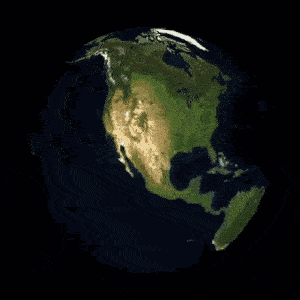

3D Earth with Mapbox GL, D3 and A-Frame
===

My *noob* attempt to create a 3D earth out of [Mapbox GL](https://www.mapbox.com/mapbox-gl-js/api/) (vector) tiles, using a little of [D3](https://d3js.org/) and [A-Frame](https://aframe.io/).

Note that I'm still figuring out how these WebGL/Canvas/3D/performance thing. **Contributions and pull requests are welcomed!**

Tweets:

- https://twitter.com/cheeaun/status/904317333862203392
- https://twitter.com/cheeaun/status/904341545293275136

Getting started
---

1. `git clone` this repository
2. `npx serve` to load a local server

Todos (Contributions welcomed!)
---

- Better performance with the raster reprojection
- Less CPU usage
- Fix the weird equirectangular dimension
- Replace A-frame with ThreeJS? (*tentative*)

Resources
---

*Sorted by importance*

- https://blog.mapbox.com/mapbox-gl-js-ar-js-a-frame-vr-mapbox-ar-vr-93c09be08742
- https://aframe.io/docs/
- http://hanmomhanda.github.io/mastering-d3-html/chapter11/05-raster/
- https://bl.ocks.org/rasmuse/75fae4fee3354ec41a49d10fb37af551
- https://github.com/rasmuse/d3-geo-warp
- https://bl.ocks.org/mbostock/4329423
- https://github.com/tizzle/aframe-orbit-controls-component
- https://github.com/d3/d3-geo/
- https://developer.mozilla.org/en-US/docs/Web/API/WebGLRenderingContext
- https://developer.mozilla.org/en-US/docs/Web/API/CanvasRenderingContext2D
